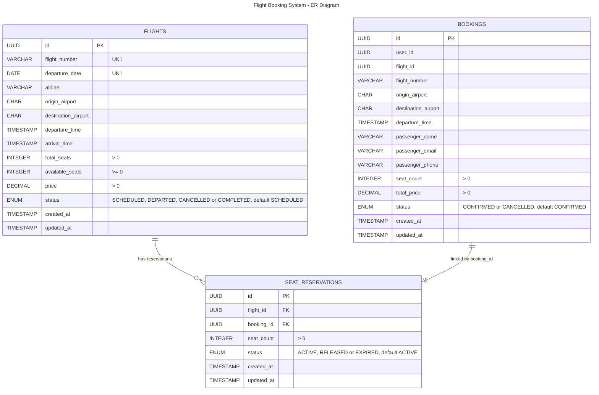

```mermaid
---
title: Flight Booking System - ER Diagram
---
erDiagram
    FLIGHTS ||--o{ SEAT_RESERVATIONS : "has reservations"
    
    FLIGHTS {
        UUID id PK
        VARCHAR flight_number "UK1"
        DATE departure_date "UK1"
        VARCHAR airline
        CHAR origin_airport
        CHAR destination_airport
        TIMESTAMP departure_time
        TIMESTAMP arrival_time
        INTEGER total_seats "> 0"
        INTEGER available_seats ">= 0"
        DECIMAL price "> 0"
        ENUM status "SCHEDULED, DEPARTED, CANCELLED or COMPLETED, default SCHEDULED"
        TIMESTAMP created_at
        TIMESTAMP updated_at
    }
    
    SEAT_RESERVATIONS {
        UUID id PK
        UUID flight_id FK
        UUID booking_id FK
        INTEGER seat_count "> 0"
        ENUM status "ACTIVE, RELEASED or EXPIRED, default ACTIVE"
        TIMESTAMP created_at
        TIMESTAMP updated_at
    }
    
    BOOKINGS ||--|| SEAT_RESERVATIONS : "linked by booking_id"
    
    BOOKINGS {
        UUID id PK
        UUID user_id
        UUID flight_id
        VARCHAR flight_number
        CHAR origin_airport
        CHAR destination_airport
        TIMESTAMP departure_time
        VARCHAR passenger_name
        VARCHAR passenger_email
        VARCHAR passenger_phone
        INTEGER seat_count "> 0"
        DECIMAL total_price "> 0"
        ENUM status "CONFIRMED or CANCELLED, default CONFIRMED"
        TIMESTAMP created_at
        TIMESTAMP updated_at
    }
    
    %% flight_status:
    %% SCHEDULED
    %% DEPARTED
    %% CANCELLED
    %% COMPLETED

    %% reservation_status:
    %% ACTIVE
    %% RELEASED
    %% EXPIRED

    %% booking_status:
    %% CONFIRMED
    %% CANCELLED
```